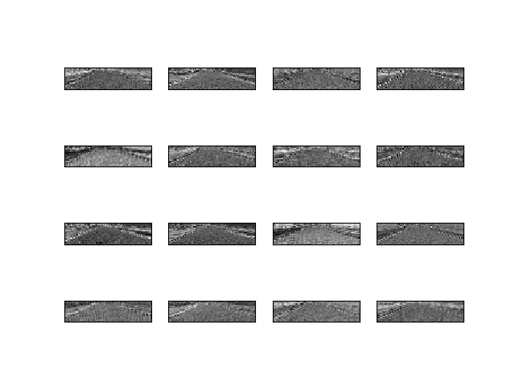

# Behavioral Cloning 
### Solution Design Approach
* The overall strategy for deriving a model architecture was to make the car drive autonomously on the map.
* My first step was to use a convolution neural network model similar to the model mentioned in “NVIDIA’s, End-to-End Deep Learning for Self Driving Cars” Article, thought this model might be appropriate because this was designed for a specific use case similar to this project. Initially tried including some “Max Pooling layers” in between layers in order to make the “Effective receptive field” of the last convolutional layer cover the whole picture given as input so as to use most of the information from the image or picture, but measurements for height and width for subsequent convolutional layers were becoming small, this issue made me to revert back to the original standard model.
* In order to gauge how well the model was working, I split my image and steering angle data into a training and validation set. Initially tried with just two laps of data from the game but this didn’t give much reliable validation loss decrease and performance in-game when switched to autonomous mode, also the data used here doesn’t include any sort of augmentation or flipping, etc. Based on the previous model performance observations collected three laps of data and also collected while driving in the opposite direction. This time the individual batch data is being augmented with the left, right camera images, flipped images. I found that my second model had a low mean squared error on the training set and a relatively low mean squared error on the validation set. This implied that the model will work with good and quality data. But still, there could be a decrease in the validation set error ( because the model may have overfitted the data because of the large data).
* To combat the overfitting, I modified the model by adding two dropout layers in between fully connected layers with different leave probabilities. After training the loss curve :

* From the above loss curve over some epochs, it is evident that it is generalizing well on the data. The final step was to run the simulator to see how well the car was driving around track one. At the end of the process, the vehicle is able to drive autonomously around the track without leaving the road.
## Model Architecture
#### An appropriate model architecture has been employed
* My model consists of a convolution neural network with 5x5 filter sizes and depths 24,36,48, 3x3 filter sizes and depths 64 , 64 (model.py lines 153-165)
The model includes ELU(Exponential Linear Units) layers to introduce nonlinearity , and the data is normalized in the model using a Keras lambda layer .
                    
 Model Architecture Employed for this task.
* The above model was taken from NVIDIA's end-to-end deep learning for a similar task. Though it differs by the input layer input size here in this project the input layer accepts (?,160,320,3) followed by a cropping so effectively input is of shape (?,85,320,3).
#### Attempts to reduce overfitting in the model
* The model contains dropout layers in order to reduce overfitting (model.py lines 172,176).
The model was trained and validated on different data sets to ensure that the model was not overfitting (code line 20-127). The model was tested by running it through the simulator and ensuring that the vehicle could stay on the track.
#### Model parameter tuning
* The model used an adam optimizer, so the learning rate was not tuned manually (model.py line 187).
* Batch Size : 32
* Epochs : 6
#### Appropriate training data
* Training data was chosen to keep the vehicle driving on the road. I used a combination of center lane driving data, left camera data with an offset in the steering angle by +0.2 , right camera data with an offset in the steering angle by -0.2.
* Also used the data collected by driving the car in the opposite direction this also augments the data there by making the network generalize well on new data from similar environments.
* For each image in the training data and validation data (Split using sklearn train_test_split method) I augmented the batch data with the corresponding flipped image horizontally and also changed steering accordingly(multiplying by -1).
#### Creation of the Training Set & Training Process
* To capture good driving behavior, I first recorded three laps on track one using center lane driving and three laps in opposite direction center lane driving  Here is an example image of center lane driving:

* To augment the data set, I also flipped images and angles thinking that this would make it generalize well on the images with similar structure of road and texture and environment that it has never seen in the training set For example, here is an image that has then been flipped:
* For each image entry into network it is clipped 25 px from bottom and 50 px from top to remove noise that is not required for predicting the steering ange . Here is the image showing the image after performing cropping:
* After the collection process, I had 6 images per entry in the “driving_log_combined.csv” file , so i had a total of 3917 * 6 = 23502 in total, in each batch i had 192 images .
* I have used a generator function common for both train and valid data to provide with a specific batch data on the go without needing to load all of the data at once into memory. In each epoch the data is shuffled and then divides into batches and is then given for training or for validation.
* I used this training data for training the model. The validation set helped determine if the model was over or under fitting. The ideal number of epochs was 6(for me), i tried with 10 epochs but at 6 th epoch the validation set error increased and it crossed the training set accuracy .The following plot shows that the model did not perform well or did not generalize well after 6th epoch because it crossed the training loss. I used an adam optimizer so that manually training the learning rate wasn't necessary.

### Visualizing the feature maps for a specific Image to the model

#### Original Picture:

#### Plot showing the 16 feature map response of first Convolution layer:
##### NOTE: FEATURE MAPS OF CROPPED IMAGE.

* Above plot of feature maps clearly shows that first convolutional layer identifies the low level features of the road that are important for a perfect steering angle, it detectes features like texture, side lane lines, etc.
 
#### Here is the link to the output video of car maneuring around the lap 
https://youtu.be/0ILeNh6LE4Q
